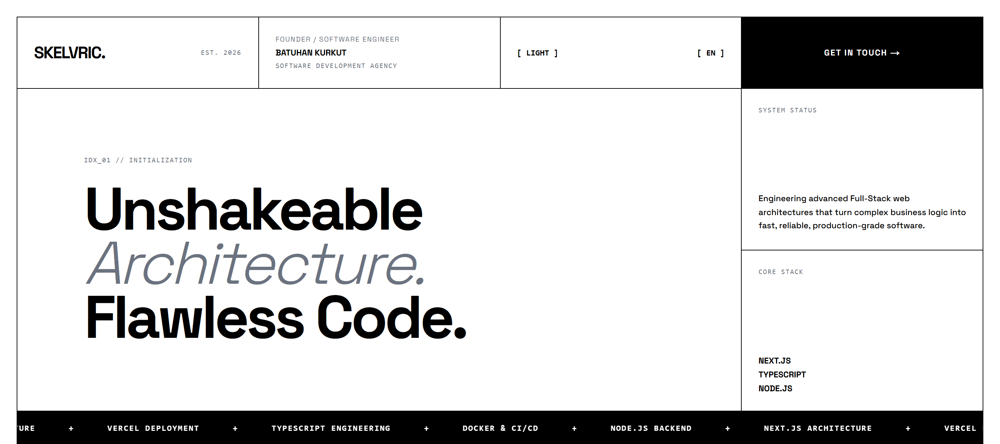

<p align="center">
  
</p>

### Skelvric

> **Skelvric** is a modern software agency building high-performance full-stack web applications, custom digital products, and scalable software solutions.

This repository contains the official website source code of Skelvric, designed with a **Visible Grid** and **Swiss / Neo-Brutalist** design philosophy, built using **Next.js App Router**, **TypeScript**, and **Tailwind CSS**.

---

#### 🚀 Features

- **Visible Grid & Swiss Design:** Industrial engineering aesthetic featuring sharp 1-pixel grid borders, zero rounded corners, and raw high-contrast typography.
- **Dual Language Support (i18n):** Centralized localization via `data/content.ts` supporting **English (Default)** and **Turkish**.
- **Dark / Light Theme Support:** Hard-switch theme toggling fitting the neo-brutalist manifesto.
- **Modular Architecture (CSS Modules):** Isolated styling for every section using `.module.css` files.
- **Fully Responsive:** Smooth adaptation from a 4-column desktop grid to a clean single-column vertical report layout on mobile devices.

---

#### 🛠️ Tech Stack

- **Framework:** [Next.js](https://nextjs.org/) (App Router)
- **Language:** [TypeScript](https://www.typescriptlang.org/)
- **Styling:** [Tailwind CSS](https://tailwindcss.com/) & CSS Modules

---

#### 📁 Project Structure

```text
skelvric/
├── app/
│   ├── globals.css          # Global theme variables & main grid styles
│   ├── layout.tsx           # Root layout & font definitions
│   └── page.tsx             # Main page, language & theme state manager
├── components/
│   ├── Navbar/              # Navigation, language & theme toggle cells
│   ├── Hero/                # Manifesto & system status panel
│   ├── Marquee/             # Scrolling tech ticker
│   ├── Work/                # Selected works & case study cards
│   ├── Services/            # Expertise/Bento grid service cards
│   ├── Approach/            # Engineering philosophy
│   ├── Process/             # 4-stage agile workflow schema
│   ├── Clients/             # Target industry sectors
│   ├── CTA/                 # Action call & contact area
│   └── Footer/              # Terminal-style footer & location details
├── data/
│   └── content.ts           # Centralized EN and TR text database
├── tailwind.config.ts       # Tailwind configuration
├── tsconfig.json            # TypeScript settings
└── package.json             # Project dependencies
